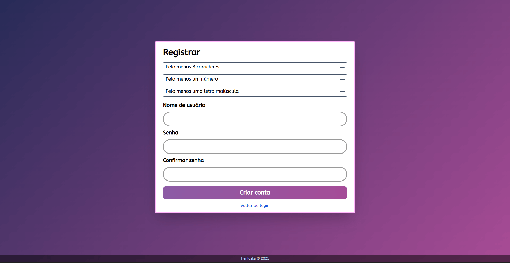
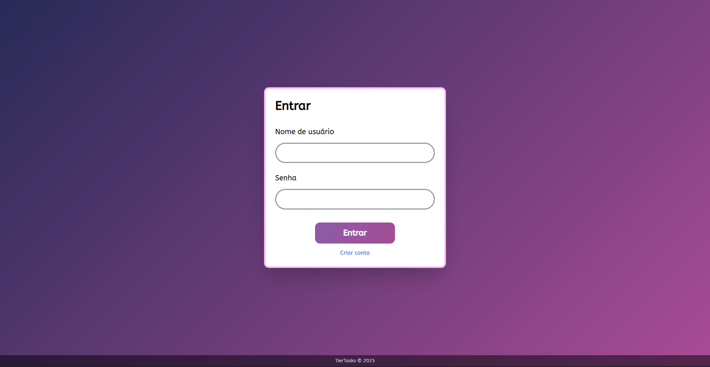
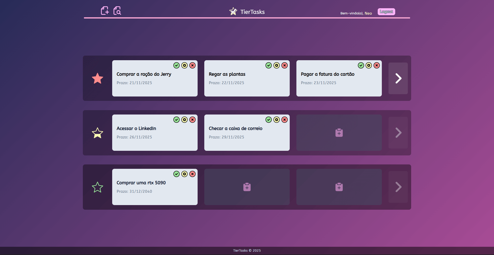
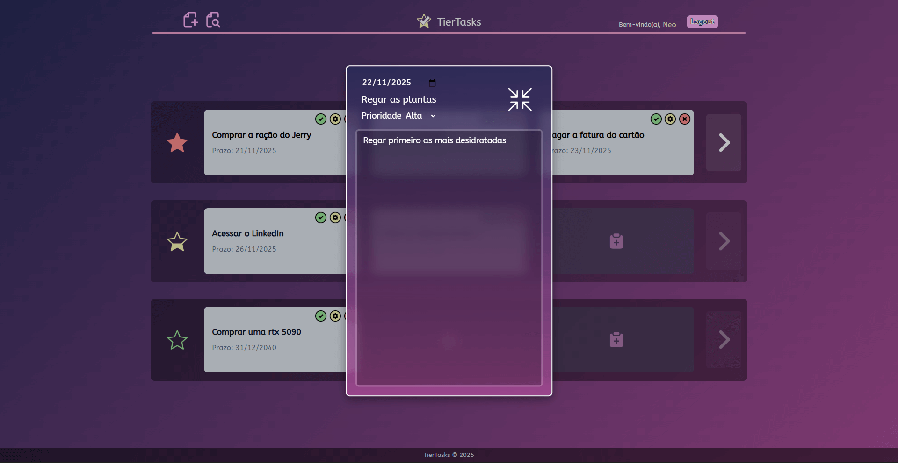
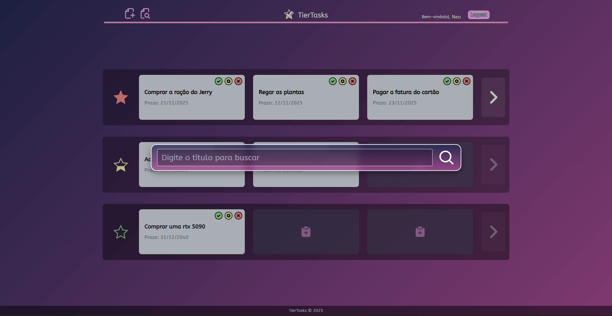

# </img> TierTasks


> Aplicação web simples em Django para gerenciar tarefas pessoais organizadas em níveis de prioridade (tiers). O projeto oferece autenticação de usuários, criação/edição/exclusão de tarefas e uma interface responsiva.

---

## 📌 Sobre o Projeto


### ✅ Principais objetivos:

fornecer uma lista de tarefas com foco em prioridade visual (alta / média / baixa) e fluxos básicos de UX (modais, filtros, pesquisa simples).

### 🖥️ Tecnologias:

Python, Django, PostgreSQL, Tailwind CSS.

---

### 👥 Autores

* **Clenilton:** Página principal e configurações básicas.
* **Eduardo:** Elaboração das views principais do projeto.
* **Jonathan:** Integração com banco de dados em nuvem e páginas de Login e Cadastro.

---

## Requisitos mínimos:
- **Python:** 3.10 ou superior
- **Dependências:** especificadas em `requirements.txt`

---

## ⚡ Como Rodar

1) Criar e ativar o ambiente virtual:

```powershell
python -m venv .venv
.\.venv\Scripts\Activate
```

2) Instalar dependências:

```powershell
pip install -r requirements.txt
```

3) Rodar migrações:

```powershell
python manage.py makemigrations
python manage.py migrate
```

4) Iniciar o servidor de desenvolvimento:

```powershell
python manage.py runserver
```

Abra `http://127.0.0.1:8000/` no navegador.

---


## 🚀 Uso Rápido

### 📋 Registrar: Crie uma conta na página de registro e acesse via login.

> Os requisitos são para a senha.

</img>

### 🔐 Logar: acesse a conta pela página de login.

</img>

### 📊 Dashboard: A página principal exibe suas tarefas organizadas por grupos (tiers) de prioridade (Alta, Média e Baixa).

> Use os botões rápidos no card para marcar como concluída, editar ou excluir a tarefa. 

</img>

### ✏️ Criar Tarefa: Use o botão no cabeçalho ou os slots vazios para abrir o modal de criação. 

> Preencha o título (obrigatório), prioridade (obrigatório), prazo e descrição.

</img>


### 🔍 Pesquisar: O botão de busca no cabeçalho abre um modal para filtrar tarefas pelo título.

> Esvazie para limpar o filtro.

</img>


---

## 🔗 Rotas importantes

- `GET /`  página principal (requer login).
- `GET/POST /register/`  registrar usuário.
- `GET/POST /login/`  login (usa `LoginView` do Django).
- `POST /logout/`  logout (usa `LogoutView` do Django).
- `POST /toggle/<task_id>/`  alterna `completed`.
- `POST /delete/<task_id>/`  deleta tarefa.
- `POST /update/<task_id>/`  atualiza título/descrição/prazo/prioridade.

---

## 📂 Estrutura do Projeto

- `assets/screenshots` : prints das principais telas.
- `static/` : arquivos estáticos (CSS, JS, imagens).
- `task_list/` : app principal.
  - `models.py` : modelo `Task`.
  - `views.py` : lógica das views (home, register, toggle, delete, update).
  - `forms.py` : `UserRegistrationForm` (valida senha).
  - `urls.py` : rotas do app.
  - `templates/task_list/` : template da página principal.
- `templates/` : template `base`.
  - `base.html/` : template `base`.
  - `registration/` : templates de `login` e `register`.
- `TierTasks/` : configurações do projeto.